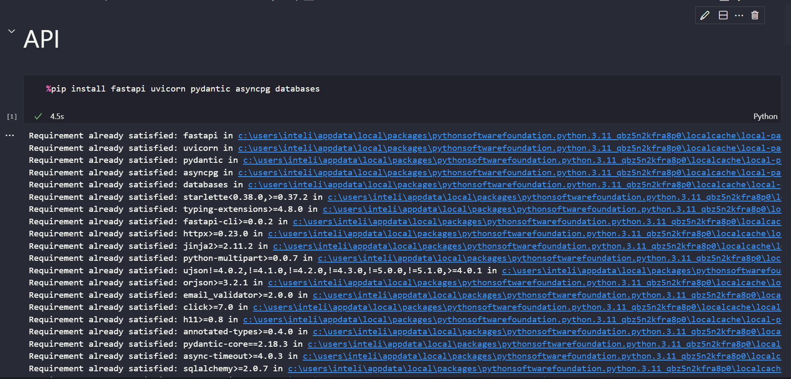
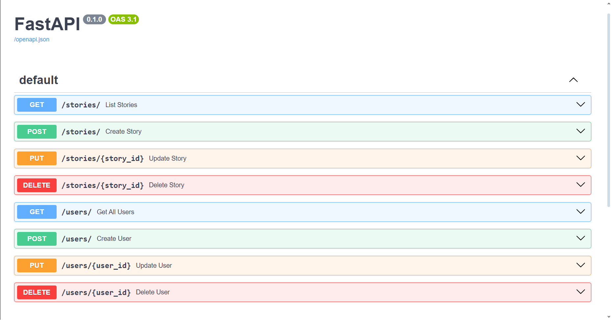

# M06-S07-API-Integrada

&emsp;&emsp; Para rodar o projeto, basta executar o notebook `main.ipynb`, que já contém células de instalação de dependências e execução do servidor, como na imagem abaixo. O servidor será executado na porta 3000, e a API estará disponível em `http://localhost:3000`. Para acessar a documentação da API, basta acessar `http://localhost:3000/docs`.

    Instação de dependências
    
    Fonte: Autoria Própria

 

## Endpoints

&emsp;&emsp; No total, foram criados 10 endpoints para a API, sendo eles para manipulação de histórias e usuários. Abaixo, segue a lista de endpoints disponíveis:

- **GET** `/stories` - Lista todas as histórias cadastradas.
- **GET** `/stories/:id` - Lista uma história específica.
- **POST** `/stories` - Cria uma nova história.
- **PUT** `/stories/:id` - Atualiza uma história específica.
- **DELETE** `/stories/:id` - Deleta uma história específica.
- **GET** `/users` - Lista todos os usuários cadastrados.
- **GET** `/users/:id` - Lista um usuário específico.
- **POST** `/users` - Cria um novo usuário.
- **PUT** `/users/:id` - Atualiza um usuário específico.
- **DELETE** `/users/:id` - Deleta um usuário específico.

    Documentação FastAPI
    
    Fonte: Autoria Própria

 

&emsp;&emsp; Abaixo, serão explicados os endpoints, seus parâmetros e retornos esperados dentro do sistema.

### Histórias

- **GET** `/stories`
    - **Parâmetros**: Não possui parâmetros.
    - **Retorno**: Retorna uma lista com todas as histórias cadastradas no sistema no formato da classe `Story` (veja a seção de Modelos).

- **GET** `/stories/:id`
    - **Parâmetros**: `id` (int) - ID da história que deseja buscar.
    - **Retorno**: Retorna uma história específica no formato da classe `Story` com acréscimo de id (veja a seção de Modelos).

- **POST** `/stories`
    - **Parâmetros**: `title` (str) - Título da história, `description` (str) - Descrição da história, `category` (str) - Categoria da história.
    - **Retorno**: Retorna a história criada no formato da classe `Story` com acréscimo de id (veja a seção de Modelos). Em caso de erro, retorna uma mensagem de erro.

- **PUT** `/stories/:id`
    - **Parâmetros**: `id` (int) - ID da história que deseja atualizar, `title` (str) - Título da história, `description` (str) - Descrição da história, `category` (str) - Categoria da história.
    - **Retorno**: Retorna a história atualizada no formato da classe `Story` com acréscimo de id (veja a seção de Modelos). Em caso de erro, retorna uma mensagem de erro.

- **DELETE** `/stories/:id`
    - **Parâmetros**: `id` (int) - ID da história que deseja deletar.
    - **Retorno**: Retorna uma mensagem de sucesso. Em caso de erro, retorna uma mensagem dizendo que a história não foi encontrada.

### Usuários
- **GET** `/users`
    - **Parâmetros**: Não possui parâmetros.
    - **Retorno**: Retorna uma lista com todos os usuários cadastrados no sistema no formato da classe `User` com acréscimo de id (veja a seção de Modelos).
- **GET** `/users/:id`
    - **Parâmetros**: `id` (int) - ID do usuário que deseja buscar.
    - **Retorno**: Retorna um usuário específico no formato da classe `User` com acréscimo de id (veja a seção de Modelos).
- **POST** `/users`
    - **Parâmetros**: `name` (str) - Nome do usuário, `email` (str) - E-mail do usuário, `password` (str) - Senha do usuário.
    - **Retorno**: Retorna o usuário criado no formato da classe `User` com acréscimo de id (veja a seção de Modelos). Em caso de erro, retorna uma mensagem de erro.
- **PUT** `/users/:id`
    - **Parâmetros**: `id` (int) - ID do usuário que deseja atualizar, `name` (str) - Nome do usuário, `email` (str) - E-mail do usuário, `password` (str) - Senha do usuário.
    - **Retorno**: Retorna o usuário atualizado no formato da classe `User` com acréscimo de id (veja a seção de Modelos). Em caso de erro, retorna uma mensagem de erro.
- **DELETE** `/users/:id`
    - **Parâmetros**: `id` (int) - ID do usuário que deseja deletar.
    - **Retorno**: Retorna uma mensagem de sucesso. Em caso de erro, retorna uma mensagem dizendo que o usuário não foi encontrado.

## Modelos
&emsp;&emsp; Abaixo, estão os modelos utilizados na API, que são retornados nos endpoints de histórias e usuários.

- **Story**
    - **id** (int) - ID da história.
    - **title** (str) - Título da história.
    - **description** (str) - Descrição da história.
    - **category** (str) - Categoria da história.

- **User**
    - **id** (int) - ID do usuário.
    - **username** (str) - Nome do usuário.
    - **email** (str) - E-mail do usuário.

## Testes
&emsp;&emsp; Para testar a API, basta acessar o link `http://localhost:3000/docs`, que abrirá a documentação da API. Nela, é possível testar todos os endpoints, passando os parâmetros necessários e verificando os retornos esperados manualmente.

&emsp;&emsp; Além disso, abaixo da célula de execução do servidor, há uma seção destinada a testes unitários e testes de integração, que testam todos os endpoints da API. Para rodar os testes, basta executar a célula e verificar se todos os testes passaram.

    Testes unitários e de integração
    
    Fonte: Autoria Própria

